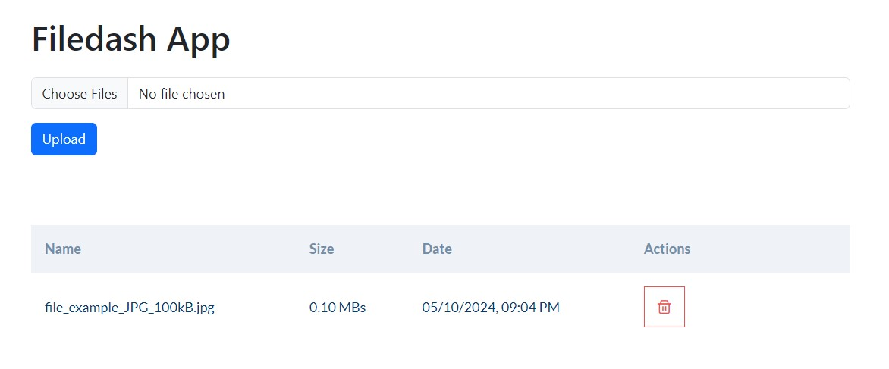

# Filedash
Filedash is a file management application with a backend web API built in .NET and a client application developed in React.

It allows users to upload files to a storage of choice and list them. Filedash manages all it's uploads via streams, so it has a very little memory footprint.

## Getting Started

To run this project locally, you will need:

-   .NET 8 SDK
-   MS SQL Server
-   Node.js

## Installation

### Preparation

-   To install EF CLI use `dotnet tool install --global dotnet-ef`

### Terminal Commands

-   Restore the dependencies and build using `dotnet restore` => `dotnet build`
-   To create a database migrations `dotnet ef migrations add "Migration_Name"`
-   Apply the database migrations using `dotnet ef database update`
-   Run the project using `dotnet run`

### Backend (API)

#### Installation

1. Clone the repository `git clone https://github.com/svetstoykov/Filedash.git`
2. Navigate to the `api/Fildash` directory and open a command-line terminal.
3. Install dependencies using `dotnet restore` and then build using `dontnet build`.
4. To create a database migrations `dotnet ef migrations add "Initial"` \*
5. Apply the database migrations using `dotnet ef database update`\*
6. Configure the database connection in `appsettings.json`.\*\*

\* You might need to append `--project Filedash.Infrastructure  --startup-project Filedash.Web` so that EF can locate the relevant projects.

\*\* For SQL_Express you will need to update the `appsettings.json` with the relevent localhost server name.

#### Running the API

Depending on what you choose you may run the api by navigating to api/Filedash/Filedash.Web and starting the app with `dotnet run`. This will startup the Kestrel server on `http://localhost:5032` (configurered in `Properties/launchSettings.json`)

Alternatively you may choose to run the application via IIS. This will start the app on `https://localhost:44338`

### Frontend (Client)

1. Navigate to the `client` directory.
2. Install dependencies using `npm install`.
3. Create an `.env` file and configure the `VITE_FILEDASH_API_URL`.
4. Start the development server using `npm run dev`.

## Usage

-   Access the Filedash web application through your browser by visiting the url you configured in the `.env` file
-   Start managing your files by uploading and organizing them as needed!

<p align="center" style="margin:30px">
    
</p>

## Application Core

### Architecture

The architecture is based around a very straightforward structure between 3 layers -> Domain, Infrastructure and Presentation.

- **Domain** - This project contains most of the applications core logic. It processes the file streams and decides what to do with them. A very important serice here is `UploadedFilesManagementService` which processes the file streams. This layer has no dependencies towards the Infrastructure and Presentation and this allows for the core logic to be decoupled from implementation. It uses `IUploadedFilesRepository` interface to communicate to the Infrastructure in an abstract way.

- **Infrastructure** - Here we keep the implementation related to the persistence and other configurations. The database used in this project is MS SQL.

- **Presentation** - The presentation is a WebAPI project with controller endpoints and the UI is made in React. The Web servers as an entry point for incoming requests, specifically designed to handle `multipart/form-data` requests.

<p align="center" style="margin:30px">
    
</p>

### Saving the files
When we first receive a save-file request the presentation layer processes the incloming `mulitpart/form-data`. Then we have the application/domain layer stream the incoming file-stream to the a temporary location on the filesystem. Then we use the injected interface of  `IUploadedFilesRepository` to call:

```
Task<bool> StreamUploadedFileAsync(
        UploadedFile file,
        Stream fileContentStream,
        CancellationToken cancellationToken = default);
```

This allows us to upload the file to a storage location of our choice without coupling it to the core logic. In addition to that using streams allows us to maintian a low memory footprint.

### Load-test

Here you can see a python script making 10 simultanious requests (5MB .mp3 file) every 3-5 seconds. The memory profile on the right shows the allocated memory and CPU usage.

https://github.com/svetstoykov/Filedash/assets/49124818/6253d20d-a60f-40a1-b0fb-59a910457cf0


## License

This project is licensed under the [MIT License](LICENSE).
